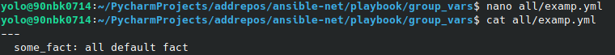

# Домашнее задание к занятию "08.01 Введение в Ansible"

## Подготовка к выполнению  
Выполнено.  
   

## Основная часть  
1. Попробуйте запустить playbook на окружении из `test.yml`, зафиксируйте какое значение имеет факт `some_fact` для указанного хоста при выполнении playbook'a.  
*Ответ*: Готово, демонстрация на скриншоте ниже.  
    
2. Найдите файл с переменными (group_vars) в котором задаётся найденное в первом пункте значение и поменяйте его на 'all default fact'.  
*Ответ*: Готово, демонстрация на скриншоте ниже.  
   
3. Воспользуйтесь подготовленным (используется `docker`) или создайте собственное окружение для проведения дальнейших испытаний.
4. Проведите запуск playbook на окружении из `prod.yml`. Зафиксируйте полученные значения `some_fact` для каждого из `managed host`.  
*Ответ*: Готово, демонстрация на скриншоте ниже.
 
5. Добавьте факты в `group_vars` каждой из групп хостов так, чтобы для `some_fact` получились следующие значения: для `deb` - 'deb default fact', для `el` - 'el default fact'.
6.  Повторите запуск playbook на окружении `prod.yml`. Убедитесь, что выдаются корректные значения для всех хостов.
*Ответ*: Готово, демонстрация на скриншоте ниже.  
 
7. При помощи `ansible-vault` зашифруйте факты в `group_vars/deb` и `group_vars/el` с паролем `netology`.
8. Запустите playbook на окружении `prod.yml`. При запуске `ansible` должен запросить у вас пароль. Убедитесь в работоспособности.   
*Ответ*: Готово, демонстрация на скриншоте ниже.
 
9. Посмотрите при помощи `ansible-doc` список плагинов для подключения. Выберите подходящий для работы на `control node`.
Ниже представлены команды с помощью которых можно получить ответ.
```
ansible-doc -t connection -l
ansible-doc -t connection local
```
10. В `prod.yml` добавьте новую группу хостов с именем  `local`, в ней разместите localhost с необходимым типом подключения.
11. Запустите playbook на окружении `prod.yml`. При запуске `ansible` должен запросить у вас пароль. Убедитесь что факты `some_fact` для каждого из хостов определены из верных `group_vars`.  
*Ответ*: Готово, демонстрация на скриншоте ниже.
 


## Необязательная часть

1. При помощи `ansible-vault` расшифруйте все зашифрованные файлы с переменными.
2. Зашифруйте отдельное значение `PaSSw0rd` для переменной `some_fact` паролем `netology`. Добавьте полученное значение в `group_vars/all/exmp.yml`.
3. Запустите `playbook`, убедитесь, что для нужных хостов применился новый `fact`.  
*Ответ*: Готово, демонстрация на скриншоте ниже.
 
4. Добавьте новую группу хостов `fedora`, самостоятельно придумайте для неё переменную. В качестве образа можно использовать  [этот](https://hub.docker.com/r/pycontribs/fedora).  
*Ответ*: Готово, демонстрация на скриншоте ниже.
 
5. Напишите скрипт на bash: автоматизируйте поднятие необходимых контейнеров, запуск ansible-playbook и остановку контейнеров.
*Ответ*: Готово, демонстрация на скриншотах ниже и файл автоматизации во вложении. В файле предусмотрено 2 варианта запуска ансибла. Через запрос пароля и через файл с паролем. [СКРИПТ](all.sh)  

Ситуация когда нет всех необходимых образов и надо скачать.
  

